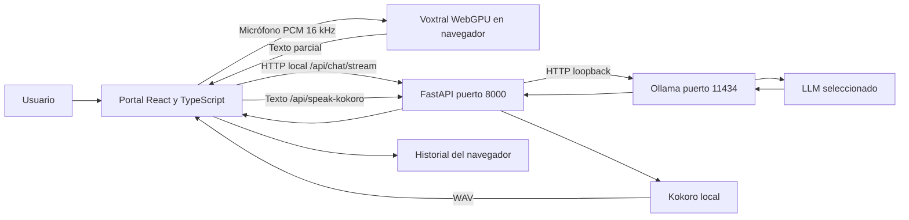

# Portal empresarial de asistencia local por texto y voz

**Trabajo final de Fundamentos de Arquitectura LLM — BSG**  
**Opción 7:** Asistente 100% Local y Privado con Ollama  
**Autor:** Alberto Upson  
**Fecha de entrega documental:** 5 de octubre de 2026

## Resumen ejecutivo

Se desarrolló un portal que permite conversar mediante texto y voz utilizando modelos ejecutados en el equipo. La arquitectura separa el reconocimiento de voz con Voxtral WebGPU, la generación de respuestas con Ollama y la síntesis de voz con Kokoro. La motivación es controlar dónde se procesa la información de una organización y reducir la dependencia de una plataforma externa.

El caso de evaluación utiliza políticas ficticias de recursos humanos. Se ejecutaron nueve inferencias locales reproducibles y se conservaron entradas, salidas, tiempos y conteos de tokens. La mediana de respuesta fue 0,4381 segundos para Ollama directo. Este dato no representa el tiempo total de una conversación hablada. La revisión cualitativa detectó invenciones del modelo: por tanto, la rapidez no equivale a confiabilidad.

El prototipo acredita ejecución local del LLM, pero no acredita todavía aislamiento integral de red ni madurez empresarial. Se documenta un procedimiento de prueba offline que el autor debe ejecutar y grabar. La decisión de alojamiento local se considera justificable por un requisito de custodia de información, no por un ahorro económico automático.

## 1. Problema y justificación

Una organización puede necesitar consultar información interna sin enviarla a un proveedor de inferencia. Un portal local permite mantener preguntas, contexto y generación dentro del dispositivo; también permite elegir y sustituir el modelo sin rehacer la interfaz. Esto no elimina los riesgos del sistema operativo, del navegador ni de las respuestas incorrectas.

Se elige una mesa de ayuda interna de RR. HH. para explicar políticas de vacaciones, cambios de datos y acceso a evaluaciones. Todos los ejemplos son ficticios. El sistema genera borradores para revisión humana; no decide contrataciones, desempeño, autorizaciones ni derechos laborales.

## 2. Objetivos

**General:** implementar y evaluar una interfaz local por texto y voz que asista en consultas internas, explicitando los compromisos entre privacidad, calidad, latencia y costo.

**Específicos:** ejecutar el LLM por Ollama; conservar el contexto por conversación; integrar entrada y salida de voz local; medir el rendimiento real; estimar el costo equivalente gestionado; identificar dependencias externas y establecer un protocolo verificable de desconexión.

## 3. Alcance y exclusiones

El prototipo implementa chat, historial en localStorage, selección persistida de modelo, ramas, copia, exportación, lectura y conversación por voz. El contexto se introduce manualmente. No incluye RAG, carga de documentos, integración con ERP, SSO, roles, cifrado propio del historial, auditoría corporativa ni despliegue multiusuario.

La captura continua es la opción predeterminada. El usuario puede finalizar un turno manualmente; el envío automático por pausas es opcional. Las mejoras recientes de transcripción están compiladas, pero requieren una prueba de voz reproducible para afirmar una latencia determinada.

## 4. Arquitectura implementada

Vite sirve la interfaz en 127.0.0.1:5173 y redirige `/api` a FastAPI. Ollama recibe el mensaje actual y una porción del historial. La configuración usa 4096 tokens de contexto y 256 tokens máximos de generación. El historial enviado se acota además a 20 mensajes y un presupuesto de caracteres. No es memoria ilimitada.

Voxtral utiliza pesos ONNX q4f16 y WebGPU. Sus palabras parciales se incorporan a la interfaz. Kokoro usa la voz española `ef_dora`. Los componentes de Faster-Whisper, Voxtral CUDA y Chatterbox permanecen como código heredado, pero no son el flujo predeterminado. El usuario no debe confundir su presencia con su ejecución.

## 5. Elección tecnológica y hardware

React y TypeScript facilitan una interfaz interactiva; FastAPI concentra la conexión local con Ollama y la voz; Ollama permite intercambiar modelos; WebGPU aprovecha la GPU desde el navegador. El LLM usado para evaluar fue Llama 3.2 3B, en Q4_K_M.

Equipo observado: Intel Core i5-13400, aproximadamente 32 GB de RAM instalada, NVIDIA RTX 3090 de 24 GiB, Windows. Se registró controlador NVIDIA 616.92. Son condiciones de esta evaluación, no requisitos mínimos certificados. Para texto solo, las necesidades son menores; para voz y LLM simultáneos debe medirse el margen de GPU. Un modelo 35B puede competir con Voxtral y Kokoro por memoria.

## 6. Metodología de evaluación

Tres solicitudes ficticias se repitieron tres veces en secuencia. El script conserva cada respuesta, tiempo hasta el primer texto, tiempo total, tiempo de carga, tokens y motivo de terminación. Usa el mismo prompt del servidor y parámetros equivalentes, pero llama directamente a Ollama. No mide el navegador, transporte FastAPI, reconocimiento ni síntesis.

La primera solicitud incluye 4,1296 segundos reportados de carga. No se afirma una prueba de arranque frío controlada: no se vació expresamente la caché del sistema. Las repeticiones pueden aprovechar cachés. Nueve muestras no bastan para generalizar rendimiento bajo concurrencia. Las cifras y cálculos completos están en RESULTADOS.md.

## 7. Seguridad y privacidad

El diseño operativo usa servicios locales y no requiere una API gestionada para contestar. Sin embargo, descargar modelos de Hugging Face, dependencias Python/JavaScript y componentes de voz requiere internet durante la preparación. La caché no es una garantía arquitectónica contra comunicaciones externas. `OLLAMA_URL` es configurable y una instancia de Ollama podría ofrecer modelos cloud; ambas rutas deben restringirse para un entorno empresarial.

No se detectaron SDK de analítica explícitos en el código propio revisado. Esta revisión estática no equivale a una auditoría completa de dependencias ni a una captura de tráfico. No se ejecutó una desconexión de red durante esta elaboración. La evidencia offline está pendiente y se documenta cómo obtenerla sin simular resultados.

## 8. Resultados y discusión

La inferencia de texto fue rápida en el equipo evaluado, pero el modelo introdujo requisitos no presentes en la política: por ejemplo, solicitar una copia de identidad o ampliar el acceso a evaluaciones a familiares. Estos resultados impiden usarlo como fuente normativa autónoma. Debe citar el documento, rechazar inferencias no sustentadas y pasar por revisión humana.

La evaluación económica distingue medición local de estimación de API. Para cargas pequeñas, una API de un modelo pequeño puede ser mucho más barata que comprar y mantener el equipo. La ventaja local es el control operativo y de datos cuando ese requisito es obligatorio. No se midió latencia de API ni se realizó un envío externo de los casos.

## 9. Hoja de ruta empresarial

1. Cerrar la prueba sin internet y medir STT/TTS de extremo a extremo.
2. Servir todos los pesos y runtimes desde almacenamiento interno; bloquear salida de red para los procesos de inferencia y navegador de demostración.
3. Validar destinos loopback y permitir solo modelos locales aprobados; fijar versiones y procedencia de artefactos.
4. Incorporar SSO, autorización por documento, cifrado, retención y eliminación de conversaciones.
5. Añadir búsqueda documental con fuentes verificables y evaluar fidelidad antes de usar datos reales.
6. Desplegar detrás de HTTPS y una red interna administrada, con cuotas, auditoría y pruebas de concurrencia.

La versión presente escucha en loopback. Cambiarla a una interfaz pública sin esos controles no es un despliegue empresarial seguro.

## 10. Conclusión

El proyecto demuestra la viabilidad de un portal conversacional de inferencia local y entrega mediciones propias reproducibles. Para el caso sensible, self-hosted puede ser la decisión correcta por control de datos, aunque no sea la más barata. El resultado honesto es un prototipo supervisado: aún deben cerrarse la evidencia offline, la evaluación de voz y los controles de producción. La confidencialidad y la exactitud son objetivos diferentes; ninguna debe darse por lograda solo por instalar un modelo local.

## Referencias

- [Código base Voxtral WebGPU](https://huggingface.co/spaces/mistralai/Voxtral-Realtime-WebGPU).
- [Pesos ONNX de Voxtral](https://huggingface.co/onnx-community/Voxtral-Mini-4B-Realtime-2602-ONNX).
- [Ollama, documentación](https://docs.ollama.com/).
- [Kokoro](https://github.com/hexgrad/kokoro).
- [Precios Amazon Bedrock](https://aws.amazon.com/bedrock/pricing/), consultados el 5 de octubre de 2026.
- Consigna de BSG proporcionada por el estudiante, «Proyecto final, opción 7». No se redistribuye el documento completo del curso.
